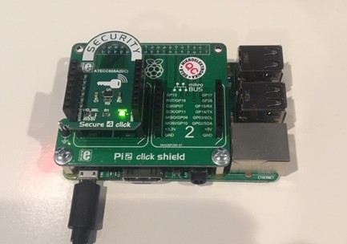
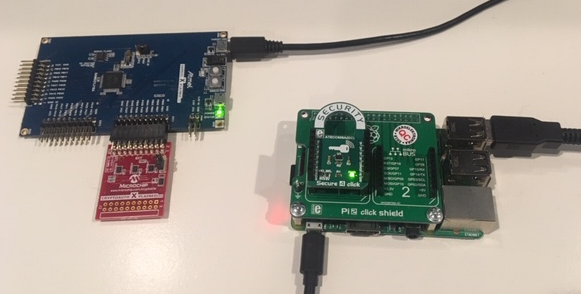

# Demo Setup for Cryptoauthlib PKCS11 and Greengrass on Raspberry Pi

* Setup the Raspberry Pi for greengrass following the [AWS tutorials](https://docs.aws.amazon.com/greengrass/latest/developerguide/gg-gs.html)
for the Raspberry Pi. Modules 1 & 2 need to be completed before moving forward with the pkcs11
credentials.
* Perform the steps detailed in [[PKCS11 Linux Setup]] to set up cryptoauthlib as a pkcs11 provider.

## Hardware Setup

### Using the [Secure 4 Click](https://www.mikroe.com/secure-4-click)


* [Secure 4 Click](https://www.mikroe.com/secure-4-click)
* [Pi 3 Click Shield](https://www.mikroe.com/pi-3-click-shield)


### Using the [Cryptoauthentication Starter Kit](https://www.microchip.com/developmenttools/ProductDetails/DM320109)


The starter kit communicates to the Raspberry Pi via USB-HID and will require udev rules to be configured.
See [[Udev Rules]] 

## Probing the device
An uninitialized device with the defaults provided in the readme will display the following:
```
pi@raspberrypi:~ $ p11tool --list-all
Object 0:
        URL: pkcs11:model=ATECC608A;manufacturer=Microchip%20Technology%20Inc;serial=9F9CB19FF7BF;token=0123EE;object=device;type=private
        Type: Private key
        Label: device
        Flags: CKA_PRIVATE; CKA_SENSITIVE;
        ID:
```

### Troubleshooting if the device does not appear at all

```
pi@raspberrypi:~ $ p11tool --list-all
p11-kit: ateccx08: module failed to initialize: An error occurred on the device
pkcs11_init: PKCS #11 initialization error.
warning: no token URL was provided for this operation; the available tokens are:
```

Probe the bus and obtain the actual device address

```
pi@raspberrypi:~ $ i2cdetect -y 1
     0  1  2  3  4  5  6  7  8  9  a  b  c  d  e  f
00:          -- -- -- -- -- -- -- -- -- -- -- -- --
10: -- -- -- -- -- -- -- -- -- -- -- -- -- -- -- --
20: -- -- -- -- -- -- -- -- -- -- -- -- -- -- -- --
30: -- -- -- -- -- -- -- -- -- -- -- -- -- -- -- --
40: -- -- -- -- -- -- -- -- -- -- -- -- -- -- -- --
50: -- -- -- -- -- -- -- -- -- -- -- -- -- -- -- --
60: -- -- -- -- 64 -- -- -- -- -- -- -- -- -- -- --
70: -- -- -- -- -- -- -- --
```

Remember the expected format for the device address is shifted left 1 bit from
the value returned from i2cdetect. Thus edit /var/lib/cryptoauthlib/0.conf
with the probed value (0x64 becomes 0xC8 when shifted):

```
# Reserved Configuration for a device
# The objects in this file will be created and marked as undeletable
# These are processed in order. Configuration parameters must be comma
# delimited and may not contain spaces

interface = i2c,0xC8
freeslots = 1,2,3

# Slot 0 is the primary private key
object = private,device,0

# Slot 10 is the certificate data for the device's public key
#object = certificate,device,10

# Slot 12 is the intermedate/signer certificate data
#object = certificate,signer,12

# Slot 15 is a public key
object = public,root,15

```

## Initializing the device (using P11tool)

To initialize the device with a basic configuration (known as the standard TLS
configuration) using p11tool: 

```
pi@raspberrypi:~ $ p11tool --initialize "pkcs11:serial=9F9CB19FF7BF" --label greengrass
Enter Security Officer's PIN:
Initializing token... atcab_is_locked(config): 0
atcab_info: 0
atcab_write_config_zone: 0
atcab_lock_config_zone: 0
atcab_is_locked(data): 0
atcab_lock_data_zone: 0
atcab_genkey(0): 0
atcab_genkey(2): 0
atcab_genkey(3): 0
atcab_genkey(7): 0
done

Token was successfully initialized; use --initialize-pin and --initialize-so-pin to set or reset PINs

```

The device has to be identified in some way to p11tool using the pkcs11 string.
In this example the serial number is used which was obtained from the 
`p11tool --list-all` command previously. The label is a required field but is
currently treated as a dummy value as the library is providing that value
(this will be a field in the configuration file in the future).

## Initializing the device (using python)

Optionally the same operation can be performed using the cryptoauthlib python
module. Since the build conditions for the module have satisfied by the pkcs11
build to install the module all that is required will be:

```
pi@raspberrypi:~ $ pip install cryptoauthlib
``` 

Then clone the cryptoauthtools project:

```
pi@raspberrypi:~ $ git clone https://github.com/MicrochipTech/cryptoauthtools.git
```

### Probing with [cryptoauthtools](https://github.com/MicrochipTech/cryptoauthtools/tree/master/python/examples)

Similiarly to the above the info.py script can be used to display useful information:

```
pi@raspberrypi:~ $ python cryptoauthtools/python/examples/info.py -i i2c


Device Part:
    ATECC608A

Serial number:
    01 23 9F 9C B1 9F F7 BF EE


Configuration Zone:
    01 23 9F 9C 00 00 60 01 B1 9F F7 BF EE C1 35 00
    C0 00 00 00 83 20 87 20 8F 20 C4 8F 8F 8F 8F 8F
    9F 8F AF 8F 00 00 00 00 00 00 00 00 00 00 00 00
    00 00 AF 8F FF FF FF FF 00 00 00 00 FF FF FF FF
    00 00 00 00 00 00 00 00 00 00 00 00 00 00 00 00
    00 00 00 00 00 00 55 55 FF FF 00 00 00 00 00 00
    33 00 33 00 33 00 1C 00 1C 00 1C 00 1C 00 1C 00
    3C 00 3C 00 3C 00 3C 00 3C 00 3C 00 3C 00 1C 00


Check Device Locks
    Config Zone is unlocked
    Data Zone is unlocked

Done
```

### Using the config.py script

This script will program the same configuration as the `p11tool --initialize`
command by default but can be modified of course to suite a customer's needs.
The config.py script will by default however program a different I2C address (0xB0)
which is compatable with the AWS zero touch kit (or any system utilizing a WINC1500
module with an onboard ATECC508A)

```
pi@raspberrypi:~ $ python cryptoauthtools/python/examples/config.py -i i2c

Configuring the device with an example configuration


Serial number:
    01 23 1D 8B 27 08 91 E4 EE


Reading the Lock Status
    Config Zone: Unlocked
    Data Zone: Unlocked

Getting the I2C Address
    Current Address: C0

    The AT88CK590 Kit does not support changing the I2C addresses of devices.
    If you are not using an AT88CK590 kit you may continue without errors
    otherwise exit and specify a compatible (0xC0) address.
    Continue (Y/n): Y
    New Address: B0

Program Configuration
    Programming ATECC608A Configuration
        Success
    Verifying Configuration
        Success
    Locking Configuration
        Locked

Activating Configuration
    Activated

Generating New Keys
    Key 0 Success:
    24 A4 6B 79 13 25 68 5B 41 CA EE 6B 70 7D 34 B0
    52 87 63 41 5B 90 FB 33 D0 95 31 69 4F 8B C5 55
    F6 A4 0F A5 89 C4 44 E8 ED 14 53 E6 B1 1B 24 9D
    47 2E 25 7E 56 E3 28 85 6B DD AF FB 67 F0 0F 02

    Key 2 Success:
    9B 40 D3 95 DE A1 82 74 17 88 0D 15 B5 7E 4A 11
    54 D8 BC 69 2F 70 CD DE F2 7C E2 9D D9 76 BD 43
    FD 18 76 F9 79 4F 08 8E F0 07 08 DF AC EE F4 A8
    8A C4 7C 17 37 0A BC DA 9A D8 29 A8 60 A2 41 E5

    Key 3 Success:
    C3 86 EA 09 C4 CD B0 E9 42 F6 22 79 63 8E B4 F1
    9B AA 43 80 7E CA 94 E6 8D 17 22 40 94 82 91 F3
    14 10 61 E9 D6 3A DD D7 35 34 3A 81 D9 E8 47 30
    B5 1E 32 E5 A9 D4 3E 27 DA 32 AF 85 98 23 43 2D

    Key 7 Success:
    7B 4B E6 3E 95 22 A2 2B 59 0A 18 0B FA C0 38 D2
    CB 50 5D 3D 3A 50 C1 09 97 13 DF CD 79 79 E5 EC
    9A 82 68 FC 9D B5 4A 35 DC 93 CB B6 97 6A AB 9F
    61 A9 9F 2C 19 79 85 8E 78 BA 85 74 4D D7 75 C4


Device Successfully Configured
```

## Verifying the initialization:

Once the initialization/configuration is complete rerunning the `p11tool --list-all`
command will display the required objects:

```
pi@raspberrypi:~ $ p11tool --list-all
Object 0:
        URL: pkcs11:model=ATECC608A;manufacturer=Microchip%20Technology%20Inc;serial=9F9CB19FF7BF;token=0123EE;object=device;type=private
        Type: Private key
        Label: device
        Flags: CKA_PRIVATE; CKA_SENSITIVE;
        ID:

Object 1:
        URL: pkcs11:model=ATECC608A;manufacturer=Microchip%20Technology%20Inc;serial=9F9CB19FF7BF;token=0123EE;object=device;type=public
        Type: Public key
        Label: device
        ID:

Object 2:
        URL: pkcs11:model=ATECC608A;manufacturer=Microchip%20Technology%20Inc;serial=9F9CB19FF7BF;token=0123EE;object=root;type=public
        Type: Public key
        Label: root
        ID:
```

At this point all of the tests listed at the end of the pkcs11 readme can be
conducted however will be unnecessary as we move through the next steps for
configuring greengrass.

## Setup the Greengrass certificate 

Previously the greengrass instance should have been setup. In order to use the
hardware keys rather than the AWS provided keys a CSR has to be created using
openssl:

```
pi@raspberrypi:~ $ openssl req -engine pkcs11 -key "pkcs11:token=0123EE;object=device;type=private" -keyform engine -new -out new_device.csr -subj "/CN=NEW CSR EXAMPLE"
engine "pkcs11" set.
```

To verify the CSR created correctly
```
pi@raspberrypi:~ $ openssl req -in new_device.csr -verify -text -noout
verify OK
Certificate Request:
    Data:
        Version: 1 (0x0)
        Subject: CN = NEW CSR EXAMPLE
        Subject Public Key Info:
            Public Key Algorithm: id-ecPublicKey
                Public-Key: (256 bit)
                pub:
                    04:7b:4b:e6:3e:95:22:a2:2b:59:0a:18:0b:fa:c0:
                    38:d2:cb:50:5d:3d:3a:50:c1:09:97:13:df:cd:79:
                    79:e5:ec:9a:82:68:fc:9d:b5:4a:35:dc:93:cb:b6:
                    97:6a:ab:9f:61:a9:9f:2c:19:79:85:8e:78:ba:85:
                    74:4d:d7:75:c4
                ASN1 OID: prime256v1
                NIST CURVE: P-256
        Attributes:
            a0:00
    Signature Algorithm: ecdsa-with-SHA256
         30:46:02:21:00:dc:6c:75:8e:5d:1f:ef:b9:36:a1:a7:13:5d:
         88:bb:a6:84:4f:b4:53:92:fe:32:ce:45:23:b7:52:bc:01:b5:
         f5:02:21:00:8c:ea:ab:4f:54:63:fe:52:0b:11:a1:e5:39:07:
         ee:d4:a9:e0:28:9e:29:c2:e1:52:a0:bf:d9:42:b5:06:07:0f
```

### Submit the CSR to AWS to obtain the connection certificate. 

This can be done by using the AWS console:

* Browse to Things->Your_Greengrass_Core->Security
* Click the "View other options" button. This provides a menu of options. 
* To use the csr generated click the "Create with CSR" button and provide the new_device.csr file.
* Click the "Upload CSR" button. This should give a "Certificate Created!" success screen.
* Download the provided certificate and save it to `/greengrass/certs/` on the Raspberry Pi.
* Before closing the screen however make sure to click the "Activate" the certificate to allow connections to AWS.
* Click the "Attach a policy" button and attach the greengrass core policy created during the
greengrass tutorial

### Edit the config.json file to use the pkcs11 provider

This should align with AWS documentation however it is duplicated here.

The final step is to modify the `/greengrass/config/config.json` file to inform
greengrass of the pkcs11 provider  


First remove the `caPath`, `certPath`, and `keyPath` properties from the `coreThing` object
```
{
 "coreThing" : {
 "caPath": "root-ca-pem",
 "certPath": "cloud-pem-crt",
 "keyPath": "cloud-pem-key",
 ...
 },
 ...
}
```

#### If using p11-kit

Add the `crypto` object as below:

```
{
  "crypto": {
          "caPath": "file:///greengrass/certs/root.ca.pem",
          "PKCS11": {
                  "OpenSSLEngine": "/usr/lib/arm-linux-gnueabihf/engines-1.1/pkcs11.so",
                  "P11Provider": "/usr/lib/arm-linux-gnueabihf/p11-kit-proxy.so",
                  "slotLabel": "0123EE",
                  "slotUserPin": "00112233445566778899AABBCCDDEEFF00112233445566778899AABBCCDDEEFF"
          },
          "principals": {
                  "IoTCertificate": {
                          "privateKeyPath": "pkcs11:token=0123EE;object=device;type=private",
                          "certificatePath": "file:///path-to-core-device-certificate"
                  }
          }
  },
  "coreThing" : {
    "thingArn" : "arn:aws:iot:aws-region:aws-account-id:thing/thing-name",
    "iotHost" : "HOST_PREFIX_HERE.iot.aws-region.amazonaws.com",
    "ggHost" : "greengrass.iot.aws-region.amazonaws.com",
    "keepAlive" : 600
  },
  "runtime" : {
    "cgroup" : {
      "useSystemd" : "yes"
    }
  },
  "managedRespawn" : false
}

```

#### If not using p11-kit (using the provider directly)

Add the `crypto` object as below:

```
{
  "crypto": {
          "caPath": "file:///path-to-root-ca",
          "PKCS11": {
                  "OpenSSLEngine": "/usr/lib/arm-linux-gnueabihf/engines-1.1/pkcs11.so",
                  "P11Provider": "/usr/lib/libcryptoauth.so",
                  "slotLabel": "0123EE",
                  "slotUserPin": "00112233445566778899AABBCCDDEEFF00112233445566778899AABBCCDDEEFF"
          },
          "principals": {
                  "IoTCertificate": {
                          "privateKeyPath": "pkcs11:object=device;type=private",
                          "certificatePath": "file:///path-to-core-device-certificate"
                  }
          }
  },
  "coreThing" : {
    "thingArn" : "arn:aws:iot:aws-region:aws-account-id:thing/thing-name",
    "iotHost" : "HOST_PREFIX_HERE.iot.aws-region.amazonaws.com",
    "ggHost" : "greengrass.iot.aws-region.amazonaws.com",
    "keepAlive" : 600
  },
  "runtime" : {
    "cgroup" : {
      "useSystemd" : "yes"
    }
  },
  "managedRespawn" : false
}

```