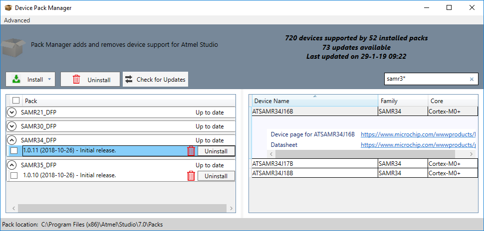

# ATECC608A-MAHTN Pre-Provisioned secure element with LoRaWAN™ TTN Join Server Getting Started Guide

## Introduction

This guide will direct you through the process of getting started with developing a secure LoRa end device product using Microchip Technology's Pre-provisioned ATECC608A secure element along with The Things Industries Join server.

This guide describes the following: 

1. [Purchasing the pre-provisioned ATECC608A-MAHTN Secure Element](TTN-Getting-Started#atecc608a-mahtn-pre-provisioned-secure-element-with-lorawan-ttn-join-server-getting-started-guide_purchasing-the-pre-provisioned-atecc608a-mahtn-secure-element)
2. [Claim pre-provisioned Secure Elements into your TTN account](TTN-Getting-Started#atecc608a-mahtn-pre-provisioned-secure-element-with-lorawan-ttn-join-server-getting-started-guide_claim-pre-provisioned-secure-elements-into-your-ttn-account)
3. [Hardware Development Tools](TTN-Getting-Started#atecc608a-mahtn-pre-provisioned-secure-element-with-lorawan-ttn-join-server-getting-started-guide_hardware-development-tools)
4. [Software packages and code example](TTN-Getting-Started#atecc608a-mahtn-pre-provisioned-secure-element-with-lorawan-ttn-join-server-getting-started-guide_software-packages-and-code-example)
5. [Next steps - Prototype to production transition](TTN-Getting-Started#atecc608a-mahtn-pre-provisioned-secure-element-with-lorawan-ttn-join-server-getting-started-guide_next-steps-prototype-to-production-transition)

## Purchasing the pre-provisioned ATECC608A-MAHTN Secure Element

The ATECC608A-MAHTN Secure Element for use with The Things Network Join Sevice can be purchased through Microchip Direct.  Microchip takes care of all the headache behind securely provisioning unique keys into each secure element - all you have to do is purchase the part, install it in your LoRaWAN end-device, and allow it to connect to The Things Network Join server.

[<center></center>](https://www.microchipdirect.com/product/ATECC608A?keywords=ATECC608A-MAHTN-T)

## Claim pre-provisioned Secure Elements into your TTN account

Once your ATECC608A-MAHTN Secure Elements ship from Microchip Direct, you will be provided with a link to download a Device Manifest file representing your specific pre-provisioned Secure Element chips.


Next, you will upload this Device Manifest file into your The Thing Networks account console.  This will claim your batch of ATECC608A-MAHTN Secure Elements within The Things Network Join server and automatically associate the secret *AppKey* and *NwkKey* keys with your account.

This is how the claiming process goes...


[<center></center>](http://ttn.fyi/joinserver/microchip)

**\*Note that your Device Manifest file will not be ready for download immediately after purchase.  Instead, the file will be available once your ATECC608A-MAHTN Secure Element devices ship.**

After you successfully claim your devices, you can check the available devices in your TTN account under registered devices list.  This ensures that your devices is properly registered and ready to talk to the cloud.

## Hardware Development Tools

### LoRaWAN Gateway
You will need a supported LoRaWAN gateway to get packets from your LoRaWAN end-point to The Things Network platform.  There are many [commercially available gateways](https://www.thethingsnetwork.org/docs/gateways/start/list.html), or you can [build your own with a Raspberry Pi](https://www.thethingsnetwork.org/docs/gateways/start/build.html) and some additional hardware.  **This guide will use [The Things Gateway](https://www.thethingsnetwork.org/docs/gateways/gateway/)**.


#### Gateway Initialization and Registration

The Things Network provides a very smooth process to activate your Gateway.  [Activate your Gateway here](https://activate.thethingsnetwork.org/)

Once the Gateway is activated, you can manage the rest of the settings through [The Things Network Console](https://console.thethingsnetwork.org/).


### Secure Element - ATECC608A-MAHTN

Your LoRaWAN end-point needs an identity, and the security of that identity is paramount!  Fortunately, the ATECC608A-MAHTN pre-provisioned part contains all the information necessary to allow your LoRaWAN end-point to securely connect with The Things Network's Join Service.  You can think of the chip like a SIM card for a mobile phone.  For development, and this guide, you will use an AT88CKSCKTUDFN-XPRO socket board to let the SAMR34 XPlained Pro board connect to The Things Network LoRaWAN Join server.  Here is how to set up the hardware.

#### The ATECC88CKSCKTUDFN-XPro Board

This board connects the ATECC608A-MAHTN part to the SAMR34 XPlained Pro board.  It is great for prototyping your LoRaWAN application because it gives you the ability to swap out the ATECC608A device so your prototype can take on different identities.  You can also proble the I<sup>2</sup>C lines with a logic analyzer to debug possible problems.

The board needs to be configured for I<sup>2</sup>C communication.  Do this by setting the DIP switches to these settings:

DIP Switch Number

* 1: <font color=Red>**---On---**</font>
* 2: **Off**
* 3: <font color=Red>**---On---**</font>
* 4: **Off**
* 5: **Off**
* 6: <font color=Red>**---On---**</font>
* 7: **Off**
* 8: **Off**

Next, you should make sure that the ATECC608A-MAHTN has been properly seated in the AT88CKSCKTUDFN-XPro Board's UDFN ZIF socket.  With the AT88CKSCKTUDFN-XPro board horizontal, with the XPro Header facing the left, the Pin 1 location will be located on the bottom-left of the clamshell socket.  It is indicated by a tiny triangle just to the right of the Jumper (JPP1).


ATECC608A-MAHTN correctly seated into the AT88CKSCKTUDFN-XPro socket...


**Note: Make sure that the Secure Element is properly seated in the socket BEFORE you close the clam shell lid.  The chip should be resting evenly in the center of the socket.  It should not be tilted or mis-alligned.  Closing the clam shell lid of the UDFN ZIF socket with the chip mis-alligned will cause the chip to get stuck in the socket and will become difficult to remove.**

#### The SAMR34 XPlained Pro Evaluation Kit

The [SAMR34 Xplained Pro \(PN: dm320111\)](https://www.microchip.com/DevelopmentTools/ProductDetails/dm320111) is a hardware platform designed to evaluate the SAMR34 family of LoRa®  devices.

This FCC, ISED and RED certified board is not only an evaluation platform but also an excellent reference design for developing SAMR34 based LoRa end-node applications.

This kit is supported by the Atmel Studio, an integrated development platform, which provides predefined application examples. The kit also provides easy access to various features of the ATSAMR34J18B device and offers additional peripherals to extend the features of the board and ease the development of custom designs.

Once you have correctly seated the ATECC608A-MAHTN part in the AT88CKSCKTUDFN-XPro socket, attach the board to the SAMR34 board, on the EXT3 header.  Next, attach a USB cable to SAMR34 XPlained Pro board's EDBG micro-B port on the right.

Here's how your board should look...


#### Other Kits

Other hardware kits can be used with the ATECC608A-MAHTN Secure Element to connect with TTN's Join server.  ARM's MBED OS is used on MBED enabled platforms, such as the ATSAML21 XPlained Pro board, paired with a SX1276 LoRa radio board.</font>

[ATSAML21-XPRO-B](https://os.mbed.com/platforms/SAML21-XPRO/)

* SX1276 LoRa radio must be connected to **EXT1** (manually wired)
* AT88CKSCKTUDFN-XPro board + ATECC608A-MAHTN must be connected to **EXT3**


## Software packages and code example

The secure element end-to-end security is supported by more than just Microchip's LoRaWAN stack.  So far, support for the ATECC608A-MAHTN Secure Element has been added to a custom stack for the SAMR34 series of SiP devices, and for MBED enabled devices like the SAML21 that can run MBED OS.

### Microchip LoRaWAN Stack on SAMR34

[Download the example for the SAMR34 XPlained Pro Evaluation Kit here. \(.zip file\)](http://ww1.microchip.com/downloads/en/DeviceDoc/SAMR34%20+%20ECC608a%20Secure%20LoRa%20End%20Node%20Software%20Code%20Example.zip)  Unzip the source code to a suitable working folder and open the "APPS_END_DEVICE_DEMO" project with Atmel Studio 7.

To build and download the project, click the empty green "Run without debugging" triangle.


 **Note:** You may need to install the Device Packages for the SAMR34 and SAMR35 devices.  Once in Atmel Studio, go to Tools>>Device Pack Manager, then search for "SAMR34" and "SAMR35".  Install these packages.



#### Running the demo

Once the demo code has been built and downloaded to your SAMR34 board, you can open a serial UART console to the board, at 115,200 baud/8-data bits/no parity/1-stop bit.  Once you have the UART console open, press the "Reset" button on the SAMR34 board to see output printed to the console.  Press "1" to send a Join Request.  If a response was received and validated, the SAMR34 board will be joined to the Join Server.  Next, press "2" to send a test packet consisting of a temperature sensor reading.

```
1. Send Join Request
2. Send Data
3. Sleep
4. Main Menu

Enter your choice: 1

Join Request Sent

Joining Successful

DevAddr: 0x26022481

***************Application Configuration***************

DevType : CLASS A

ActivationType : OTAA

Transmission Type - UNCONFIRMED

FPort - 1

*******************************************************

*******************************************************

1. Send Join Request
2. Send Data
3. Sleep
4. Main Menu

Enter your choice: 2

Temperature:23.4° C/74.1° F

Tx Data Sent
Transmission Success

*************************************************
```

If your LoRaWAN end-device was registered to The Things Network, you can validate that the data received by TTN's cloud system by viewing the raw data on your TTN console page, under the **Application Data** area.


Notice that the raw bytes of the Payload and DevAddr of the message match what is shown in UART console.

### MBED OS LoRaWAN Stack
Support for the ATECC608A-MAHTN Secure Element in the MBED OS LoRaWAN stack has been developed and brought to the MBED enabled ATSAML21-XPro-B board.  The source for this project can be [cloned from this branch of MBED OS](https://github.com/ARMmbed/mbed-os-example-lorawan/tree/ATECC608_PoC).

The MBED OS implementation of the LoRaWAN stack for the SAMR34 is not currently supported, but an implementation should be made available shortly.

## Next steps - Prototype to production transition

Once you have your prototype working just the way you want, the next step is to transition to production.  Moving to produciton is as simple as ordering the required number of parts - there are no extra steps needed in provisioning large scale numbers of devices.  There are no changes in the Secure Element claiming process.

## Support

Should you need support or if you have any feedback, please contact Microchip support by entering a support case request at http://support.microchip.com .
